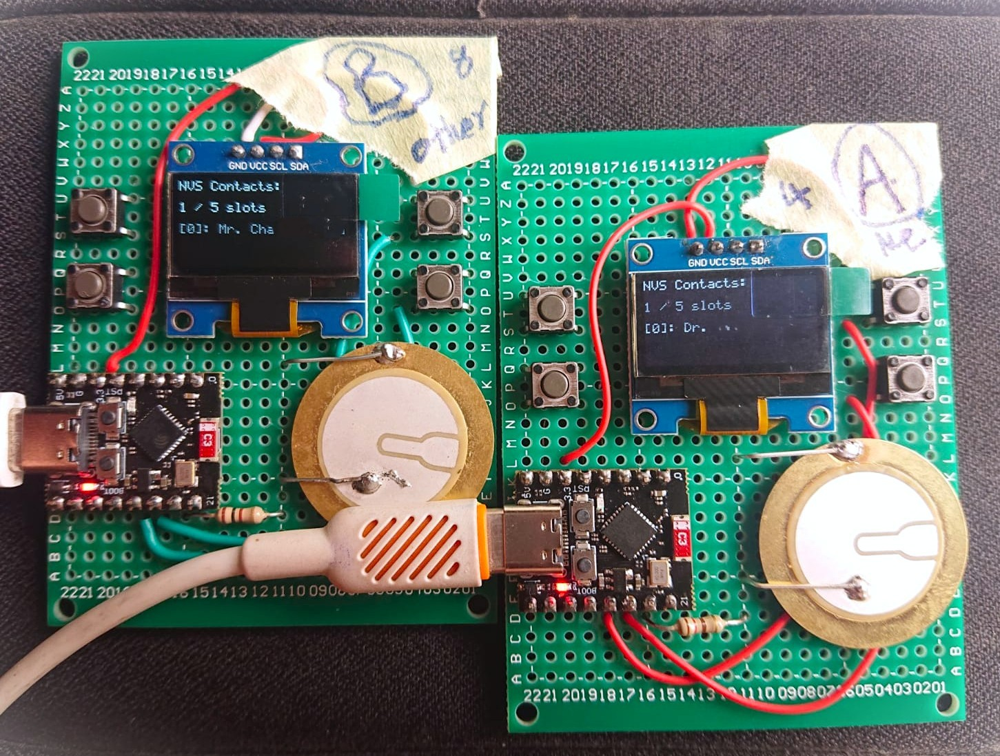

# BLE_Tap_Exchange

Firmware for a wrist-worn contact-exchange device: two people simultaneously long-press a button and their ESP32-C3 watches exchange name, phone number, and job title over Bluetooth Low Energy.



*Two prototype units after a successful tap exchange — each display shows the other device's saved contact in NVS.*

---

## What this is

Each watch runs on an ESP32-C3 Super Mini (RISC-V, 160 MHz) under ESP-IDF 5.4.3 with FreeRTOS and the NimBLE BLE stack. A long-press on the SELECT button starts a simultaneous advertising and scanning cycle. A four-gate filter on the advertising data identifies the paired device, assigns connection roles deterministically, and executes a GATT exchange before saving the received contact to NVS flash. The full protocol runs in under 10 seconds. All nine hardware bring-up tests pass; the UI screens are designed and will be in the next upload.

---

## How it works

Both watches enter share mode at the moment of button press. Each simultaneously starts BLE advertising as a Peripheral and scanning as a Central — NimBLE on ESP32-C3 supports both roles concurrently. The advertising packet includes the custom TapShare service UUID and, critically, a 5-byte manufacturer-specific data field: one magic byte (`0xC0`) followed by a little-endian `uint32_t` tap timestamp derived from `gettimeofday()` at the moment of the button press. Encoding the timestamp in the advertisement means the scanner can evaluate it from the raw GAP discovery event, before any connection is attempted.

The scanner applies four sequential gates to every discovered advertisement. Gate 1 checks for the TapShare service UUID — advertisements without it are discarded immediately. Gate 2 checks RSSI against a `-65 dBm` threshold, which corresponds empirically to approximately 30 cm; watches further apart are ignored. Gate 3 compares the peer's tap timestamp against the local one: if the absolute difference exceeds `TAPSHARE_TIME_WINDOW_S` (5 seconds), the peer is rejected as a different social interaction. Gate 4 assigns connection roles: the device with the lower tap timestamp becomes Central and calls `ble_gap_connect()`; the device with the higher timestamp waits as Peripheral. If both timestamps are equal — extremely unlikely given one-second resolution, but handled — a lexicographic `memcmp` of the two BLE MAC addresses breaks the tie. Both devices run this same logic independently from the same information and always reach the same role assignment.

Once connected, the Central runs a read-first GATT contract: it reads the peer's `Name`, `Phone`, and `Title` characteristics in sequence, then writes its own three values back. If any of the three reads fails, the write phase is skipped, ensuring neither device saves a partial contact. After all six operations complete, `BLE_EVT_EXCHANGE_COMPLETE` is posted to the service layer, the contact is written to NVS using a double-commit power-loss-safe sequence, and the connection is terminated. The NVS write marks the slot invalid before writing the data blob, commits to flash, writes the blob, marks valid, and commits again — a power loss between steps leaves the slot invalid and skipped on next boot.

The contact addressbook holds up to `TAPSHARE_MAX_CONTACTS` (5) entries in FIFO order. When the sixth contact arrives, the oldest slot is overwritten.

---

## Hardware

| Component | Part |
|-----------|------|
| MCU | ESP32-C3 Super Mini (RISC-V, 160 MHz, 400 KB SRAM) |
| Display | SSD1306 0.96" OLED, 128×64 px (I2C, 400 kHz) |
| RTC | Internal ESP32-C3 RTC (prototype v1) |
| Buttons | Four GPIO inputs, active-low, internal pull-up |
| Buzzer | Passive piezo on GPIO 20, LEDC hardware PWM |
| Wireless | BLE 5.0 via NimBLE stack |

I2C: SDA = GPIO 5, SCL = GPIO 6. Button SELECT = GPIO 9 (BOOT pin). Buzzer = GPIO 20, LEDC timer 0 channel 0, 13-bit resolution.

---

## Architecture overview

The firmware uses a four-layer model: Hardware → Drivers → Services → App. Drivers (`ssd1306_driver`, `button_driver`, `ble_driver`) know their peripheral and nothing above it. Services (`ble_service`, `time_service`, `ui_service`) own business logic and call drivers only. The App layer (FreeRTOS tasks in `tasks.c`) wires services together via queues and event groups. This separation means a hardware revision — swapping the SSD1306 for a GC9A01 round display, or the internal RTC for a DS3231 — requires editing one driver file with no changes above it. Full details are in [ARCHITECTURE.md](ARCHITECTURE.md).

---

## Project status

| Component | Status |
|-----------|--------|
| `ssd1306_driver` | Done — tested (test 01) |
| `button_driver` | Done — tested (test 02) |
| `buzzer_driver` | Done — tested (test 03) |
| `rtc_driver` | Done — tested (test 04) |
| `ble_driver` | Done — tested (tests 06–08) |
| `ble_service` (TapShare protocol) | Done — end-to-end tested (test 09) |
| `time_service` | Implemented, not yet integrated into task layer |
| `ui_service` | Implemented, not yet integrated into task layer |
| `alarm_service` | Implemented, not yet integrated into task layer |
| `stopwatch_service` | Implemented, not yet integrated into task layer |
| `tasks.c` (FreeRTOS task wiring) | Skeleton only — `app_main` is empty |
| Full UI (watch face, contact book, sharing screen) | Planned — next upload |

The current repo state is test 09: all drivers and the BLE protocol work end-to-end. The `tasks.c` integration and UI screens are the next milestone.

---

## Repository layout

```
BLE_Tap_Exchange/
├── main/
│   └── main.c                    # app_main entry point (skeleton)
├── components/
│   ├── common/
│   │   ├── include/
│   │   │   ├── app_config.h      # All pin assignments and tuning constants
│   │   │   ├── app_events.h      # All shared event types and structs
│   │   │   └── wifi_sync.h       # NTP sync helper (prototype)
│   │   └── wifi_sync.c
│   ├── drivers/
│   │   ├── ble/                  # NimBLE stack wrapper — GAP, GATT, 4-gate filter
│   │   ├── button/               # ISR-to-queue GPIO input, debounce, long-press
│   │   ├── buzzer/               # LEDC PWM audio, sound map
│   │   ├── rtc/                  # RTC read/write abstraction
│   │   └── ssd1306/              # I2C OLED driver, framebuffer, dirty-page flush
│   └── services/
│       ├── ble_service/          # TapShare state machine, NVS contact storage
│       ├── time_service/         # Second/minute tick, event group
│       ├── ui_service/           # Display rendering (planned integration)
│       ├── alarm_service/        # Out of scope for v1
│       └── stopwatch_service/    # Out of scope for v1
├── tests/                        # Nine standalone ESP-IDF test projects (01–09)
│   ├── test_config.h             # gitignored — copy from test_config.h.template
│   └── README.md                 # Test documentation
├── sdkconfig.defaults            # Committed SDK config (NimBLE, FreeRTOS 1 kHz)
└── docs/
    └── prototype.jpg
```

---

## Getting started

**Prerequisites:** ESP-IDF 5.4.x installed, `IDF_PATH` set, Python 3.8+.

```sh
# Source the IDF environment
. $IDF_PATH/export.sh

# Clone
git clone <repo-url> BLE_Tap_Exchange
cd BLE_Tap_Exchange

# Set your profile data
cp tests/test_config.h.template tests/test_config.h
# Edit test_config.h — set MY_PROFILE_NAME, MY_PROFILE_PHONE, MY_PROFILE_TITLE
```

```sh
# Build and flash
idf.py set-target esp32c3
idf.py build
idf.py -p <PORT> flash monitor
```

Replace `<PORT>` with your serial port (`/dev/ttyUSB0`, `COM3`, etc.). `test_config.h` is gitignored and never committed. If absent, the firmware falls back to `"Cylonix User"` as the profile name.

---

## Running tests

Each of the nine tests is a standalone `idf.py` project flashed independently. See [tests/README.md](tests/README.md) for per-test pass criteria, dependencies, and two-board requirements.

```sh
cd tests/09_ble_tapshare
idf.py set-target esp32c3 build
idf.py -p <PORT> flash monitor
```

---

## License

MIT
